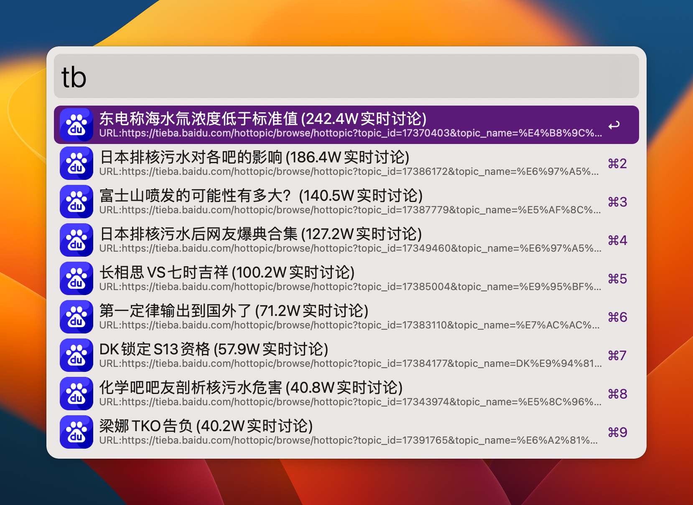

# Hot News
使用Python获取微博、知乎等热搜榜
# 安装所需模块
- 如果使用的是macOS自带Python环境(也是Alfred默认使用Python环境):
/usr/bin/python3 -m pip install -r requirements.txt
- 其他
pip install -r requirements.txt
# 使用方法
`wb [n]`获取微博热搜榜前`n`个热搜

`zh [n]`获取知乎热搜榜前`n`个热搜

`tb [n]`获取贴吧热搜榜前`n`个热搜

`rb [n]`获取知乎日报前`n`个热搜

`v2ex [n]`获取v2ex前`n`个热门帖子

`xz [n]`获取小众软件前`n`个热门帖子

> `[n]`为可选参数,无输入时,默认获取前10个热搜榜

